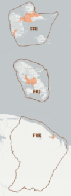
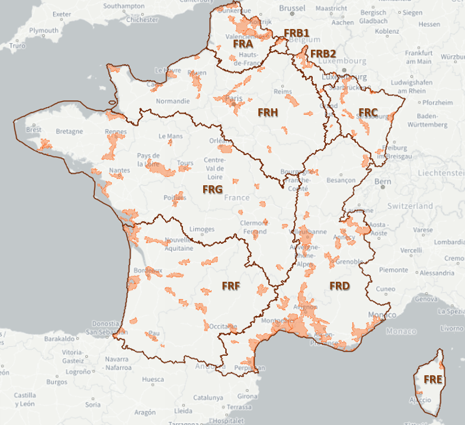
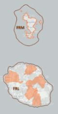
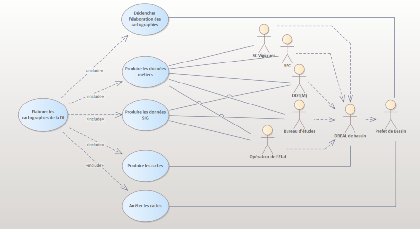
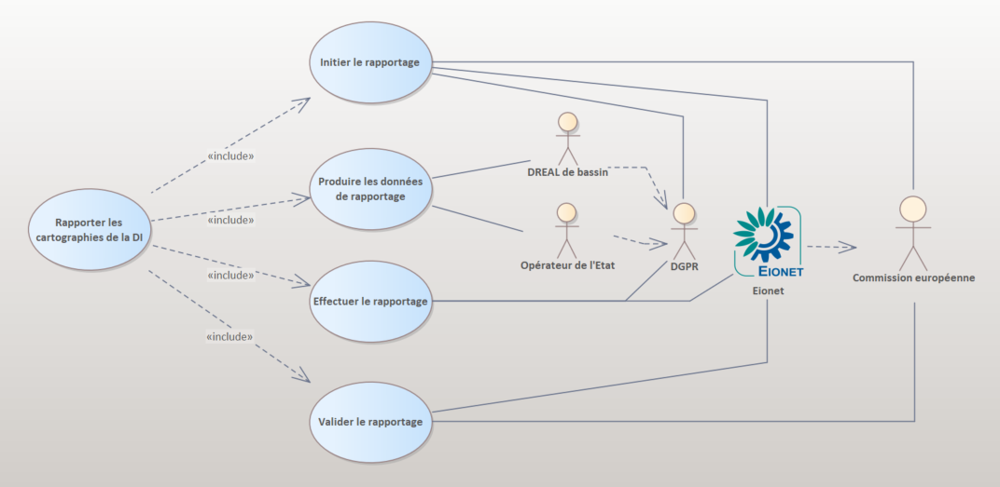
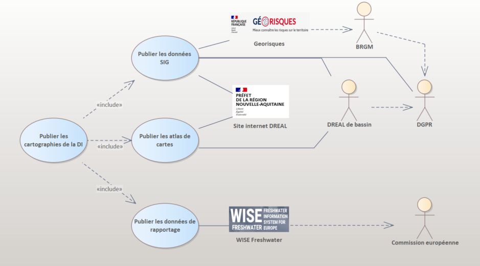
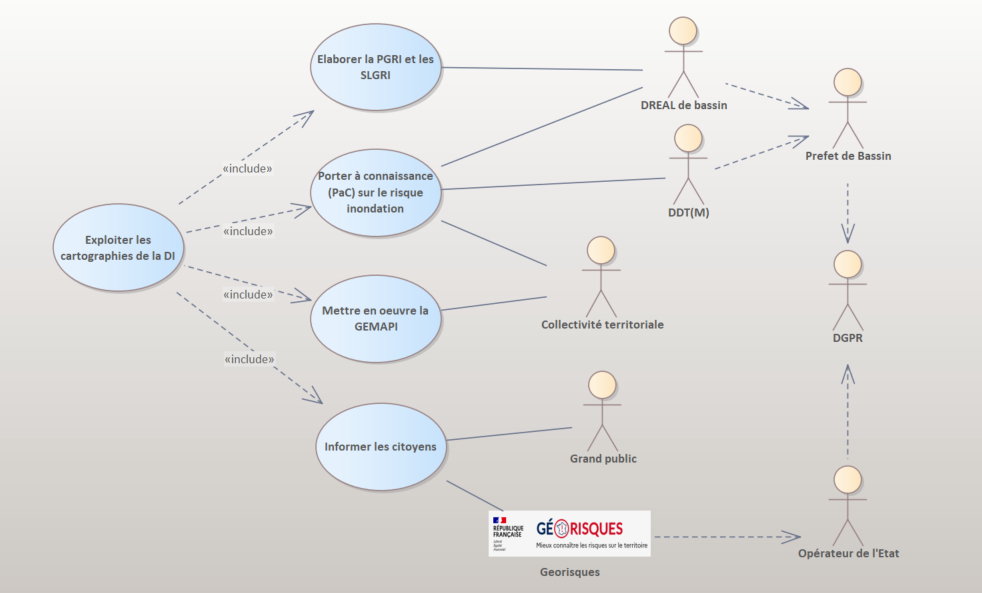
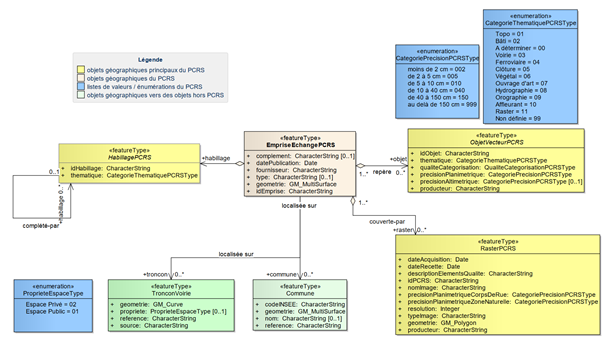
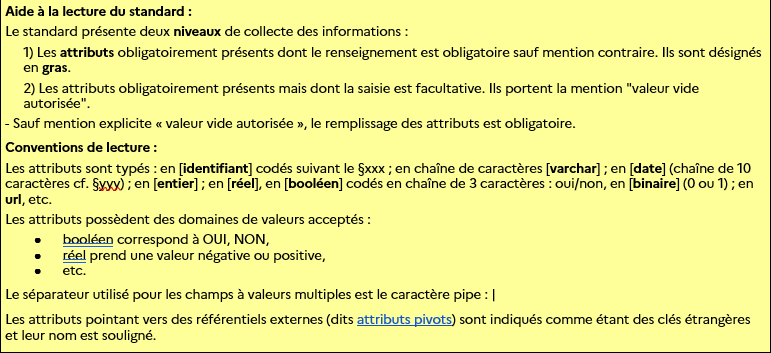

| | |
|-|-|
| |  |

 Conseil national de l'information Géolocalisée

Géostandards Risques
Cartographies de la Directive Inondation

Groupe de travail refonte des Géostandards Risques

*Version 0.0.1 - 11 décembre 2025*

# Fiche descriptive

| | |
|---|---|
| **Titre** | Géostandards Risques |
| **Sous-titre** | Cartographies de la Directive Inondation |
| **Version** | *Version 0.0.1 - 11 décembre 2025* |
| **Résumé** | La famille des Géostandards Risques a pour objectif de standardiser les données numériques géographiques relatives aux procédures réglementaires de prévention des risques. Elle a été développée dans le but de moderniser et succéder aux standards COVADIS dédiés à cette thématique tels que les standards Plan de Prévention des Risques (PPR) Naturels, Technologiques et Miniers ou Directive Inondation (DI). Elle est constituée d'un document qui établit les concepts communs à ces géostandards et d'un ensemble de profils applicatifs qui les précisent et les implémentent dans le cas de procédures particulières. Ce document est le profil applicatif dédié aux cartographies de la directive inondation. |
| **Objectif** | Ce document à pour objectif de décrire l'information géographique et sémantique des cartographies des surfaces inondables et des risques d'inondation sur les territoires à risques important d'inondation (TRI) en conformité avec le cadre réglementaire transposé de la Directive européenne sur les inondations. |
| **Etendue d'application** | Territoires à risque important d'inondation sur les bassins DCE (Directive Cadre Eau) du territoire national français *et Saint-Pierre et Miquelon (à confirmer)*. |
| **Représentation spatiale** | Données vecteur |
| **Résolution spatiale** | L'échelle cible des cartographies de la Directive Inondation est le 1:25000. *Elle peut néanmoins être plus précise lorsqu'elle est produite à partir de zones d'aléas PPR plus résolues*. |
| **Statut du document** | Projet - ~~Appel à commentaires~~ - ~~Proposé à la commission des Standards du CNIG~~ - ~~Validé~~ |
| **Licence** | Le présent document est sous Licence Ouverte v2.0 (Open Licence) Etalab |
| **Diffusion** | ``à venir`` |
| **Formats disponibles** | [HTML/Markdown](./Document.md) |
| **Thèmes** | (INSPIRE) "Zones de risque naturel" |
| **Mots clés** | "prévention" ; "risque" ; "aléa" ; "inondation" ; "directive inondation (DI)" ; "territoire à risque d'inondation (TRI)" |
| **Contact** | geostandards-risques-gt-cnig@framalistes.org - Formulaire de contact du CNIG : https://cnig.gouv.fr/spip.php?page=contact |
| **Informations complémentaires** | Ce standard annule et remplace le standard de données [COVADIS Directive Inondation v2.1](https://files.georisques.fr/di_2020/COVADIS_standard_DI_v2.1.pdf).  |

# Sommaire

:::toc
:::

# Préface

## Historique et suivi du document

| Version | Date | Chapitre modifié | Changement apporté |
| --- | --- | --- | --- |
| 0.0.1 | 11/12/2025 | Tous | Initialisation du document et début des travaux |
| 1.0 | `<mois aaaa>` | - | Publication CNIG |

## Participation à l'écriture

Ce standard est le fruit des travaux du groupe de travail CNIG sur la refonte des Géostandards risques. Ce dernier rassemble les acteurs impliqués dans l’élaboration, la gestion et la diffusion des données de prévention des risques relatives à ces standards ainsi que des utilisateurs amenés à exploiter ces données. Il est animé par l’IGN pour le compte de la Direction Générale de la Prévention des Risques (DGPR).

Ce standard a été rédigé par Gilles Cébélieu (IGN) avec les contributions majeures et les relectures des membres du Groupe de travail listés ci-dessous.

*(Participations ateliers des 11/12/2025 et 22/01/2026)*

* Abdelhakim Boulouiz (DREAL Occitanie)
* Bastien Coignon (DGPR / BRIL)
* Helene Decourcelle (DREAL Auvergne Rhone Alpes)
* Yann GASOWSKI (Groupe Artelia)
* Yohann Evain (Cerema)
* Maxime Pujeaut (DREAL Occitanie)
* Nicolas Boudesseul (DREAL Pays de la Loire)

# Présentation du document

## Objectif et raison d'être du standard

La famille des géostandards risques a pour objectif de standardiser les données numériques géographiques relatives aux procédures réglementaires de prévention des risques. Elle a été développée dans le but de moderniser et succéder aux standards COVADIS dédiés à cette thématique tels que les standards Plan de Prévention des Risques (PPR) Naturels, Technologiques et Miniers ou Directive Inondation (DI).

Elle est constituée d'un document socle [CNIG_RISQUES_COMMUN:2024](https://github.com/cnigfr/Geostandards-Risques/blob/main/standards/Geostandards-risques-commun/Document.md) qui établit les concepts communs à ces géostandards et d'un ensemble de profils applicatifs qui les précisent et les implémentent dans le cas de procédures particulières.

Ce document est le profil applicatif qui précise et implémente les concepts communs de [CNIG_RISQUES_PPR:2024](https://github.com/cnigfr/Geostandards-Risques/blob/main/standards/Geostandards-risques-commun/Document.md) pour décrire l'information géographique et sémantique des cartographies des surfaces inondables et des risques d'inondation sur les territoires à risques important d'inondation (TRI) en conformité avec le [cadre réglementaire](#cadre-réglementaire) transposé de la Directive européenne sur les inondations.

Ces cartographies doivent servir à l'établissement de plans de gestion des risques d'inondation (PGRI) à l'échelle des grands bassins hydrographiques et l'élaboration des stratégies locales de gestion des risques d'inondation (SLGRI) sur ces territoires. Ces éléments font l'objet d'un rapportage par cycles de six ans auprès de la Commission Européenne.

Ce standard s'inscrit dans une démarche générale d'harmonisation des données géographiques relatives au risque inondation. Il vise à faciliter l'entretien et la mise à jour  en continu du patrimoine des cartographies des TRI avec une intégration cohérente des données d'aléas et d'enjeux des plans de prévention des risques d'inondation (PPRI) et une banalisation des opérations du rapportage européen.

Cette harmonisation doit permettre de faciliter le porter à connaissance de l’État dans lequel l'intégration des cartographies des TRI est obligatoire. Plus généralement elle doit participer au développement de la culture du risque auprès du grand public en facilitant la mise à disposition de cette information.

Ce document a vocation à se substituer et rendre obsolète la dernière version du standard de données COVADIS Directive Inondation version 2.1 de juillet 2019.

## À qui s'adresse ce document ?

Ce document s'adresse :

* aux services de l'État ou assimilés, chargés de produire la cartographie des TRI, la maintenir, la diffuser ou la rapporter auprès de le Commission Européenne ;

* aux utilisateurs de ces données de cartographies, amenés à en prendre connaissance, les exploiter : services de l'État, collectivités locales, professionnels, bureaux d'études, ou grand public.

## Comment lire le document

`Le contenu du présent standard est réparti dans X parties et comporte Y annexes.`

`La partie 1 constitue une préface qui synthétise les informations du standard. Elle permet de retrouver ...`

`La partie 2 présente une introdutcion au document, permettant de le contextualiser et de le comprendre.`

`La partie 3 est de niveau abstrait. Elle présente les concepts du référentiel et présente des potentiels cas d'utilisation.>`

`La partie 4 contient les recommandations, obligations ou permissions liées au standard.>`

`La partie 5 est plus opérationnelle : Elle décrit l'implémentation du standard.>`

`L'annexe A est informative et spécifie xxx.`

## Références

Cette partie cite les références documentaires et réglementaires sur lesquelles s'appuie ce standard.

### Références à d'autres documents

Ce document s’appuie ou nécessite la lecture des normes et documents référencées ci-dessous (*Liste à compléter*).

| Acronyme | Titre | Auteur | Année |
|-|-|-|-|
| [CNIG_RISQUES_COMMUN:2024](https://github.com/cnigfr/Geostandards-Risques/tree/main/standards/Geostandards-risques-commun/Document.md) | Géostandards Risques - Modèle commun | Conseil National de l'Information Géolocalisée (CNIG) | 2024 |
| [CNIG_RISQUES_PPR:2025](https://github.com/cnigfr/Geostandards-risques-ppr/blob/master/standard/Document.md) | Géostandards Risques - Plans de prévention des risques (PPR) | Conseil National de l'Information Géolocalisée (CNIG) | Novembre 2025 |
| [Guide PPRI:2024](https://www.ecologie.gouv.fr/sites/default/files/documents/Guide%20PPRI%20debordement%20de%20cours%20d%27eau%202024.pdf) | Guide méthodologique pour l’élaboration des plans de prévention des risques d’inondation par débordement de cours d’eau (hors cours d’eau torrentiels) | DGPR - Cerema | 2024 |
| [Guide PPRRuis:2004](https://www.ecologie.gouv.fr/sites/default/files/Guide_m%C3%A9thodo_PPR%20Ruissellement_2004.pdf) | Guide Méthodologique PPR Ruissellement | Direction de la Prévention des Pollutions et des Risques (DPPR) | 2004 |
| [Guide PPRICet:2023](https://www.ecologie.gouv.fr/sites/default/files/GuidePPRicet_10082023.pdf) | Guide Méthodologique PPRi des cours d'eau torrentiels | DGPR | 2023 |
| [Guide PPRL:2014](https://www.ecologie.gouv.fr/sites/default/files/documents/Guide_m%C3%A9thodo_PPRL_%202014.pdf) | Guide méthodologique : Plan de prévention des risques littoraux | DGPR / SRNH | 2014 |
| [INSPIRE NZ:2013](https://inspire.ec.europa.eu/documents/Data_Specifications/INSPIRE_DataSpecification_NZ_v3.0.pdf) | INSPIRE D2.8.III.12 Data Specification on Natural Risk Zones – Technical Guidelines | European Commission Joint Research Centre | 2013 |
| [INSPIRE MTD:2013](https://inspire.ec.europa.eu/sites/default/files/documents/metadata/md_ir_and_iso_20131029.pdf) | INSPIRE Metadata Implementing Rules: Technical Guidelines based on EN ISO 19115 and EN ISO 19119 | European Commission Joint Research Centre | 2013 |
| [EauFrance](https://www.eaufrance.fr/) | Le service public d’information sur l’eau et les milieux aquatiques | OFB | En continu |
| [Référentiel Technique Sandre](https://www.sandre.eaufrance.fr/v2/) | Référentiel  technique Sandre pour le système d'information sur l'eau (SIE) |  OFB, Sandre | En continu |

### Cadre réglementaire

La mise en œuvre des cartographies des TRI se fait dans le cadre législatif de la [Directive 2007/60/CE du Parlement Européen et du Conseil du 23 octobre 2007 relative à l’évaluation et à la gestion des risques d’inondation](https://www.legifrance.gouv.fr/jorf/id/JORFTEXT000000523817).

Elle est transposée en France par la [LOI n° 2010-788 du 12 juillet 2010 portant engagement national pour l'environnement (LENE)](https://www.legifrance.gouv.fr/jorf/id/JORFTEXT000022470434) qui modifie la partie législative du code de l'environnement avec en particulier l'ajout du [chapitre IV relatif à l'évaluation et la gestion des risques d'inondation (Articles L566-1 à L566-13)](https://www.legifrance.gouv.fr/codes/section_lc/LEGITEXT000006074220/LEGISCTA000022479454/#LEGISCTA000022479454) :

* L'[article L566-5](https://www.legifrance.gouv.fr/codes/article_lc/LEGIARTI000051561789) traite de la détermination des TRIs.
* L'[article L566-6](https://www.legifrance.gouv.fr/codes/article_lc/LEGIARTI000051561783) traite des cartes des surfaces inondables et des cartes de risques d'inondation sur ces territoires.

Pour la partie réglementaire, le [décret n° 2011-227 du 2 mars 2011 relatif à l'évaluation et à la gestion des risques d'inondation](https://www.legifrance.gouv.fr/jorf/id/JORFTEXT000023654727) modifie le code de l'environnement avec l'ajout du [Chapitre VI relatif à l'évaluation et la gestion des risques d'inondation (Articles R566-1 à R566-18)](https://www.legifrance.gouv.fr/codes/.section_lc/LEGITEXT000006074220/LEGISCTA000023655627/#LEGISCTA000023655627) :

* L'[article R566-5](https://www.legifrance.gouv.fr/codes/article_lc/LEGIARTI000023655645) traite de la sélection des TRIs. (*NB arrêté en cours de modification => justification des aléas en +*)

* Les articles R566-6 à R566-9 traitent des cartes de surfaces inondables et des cartes des risques d'inondation :
  * L'[article R566-6](https://www.legifrance.gouv.fr/codes/article_lc/LEGIARTI000023655649) précise le contenu des cartes de surfaces inondables. (*NB en cours de modification => correspondance avec l'aléa de référence des PPRI + aléa échéance 100ans en submersion marine*)
  * L'[article R566-7](https://www.legifrance.gouv.fr/codes/article_lc/LEGIARTI000033942220) précise le contenu des cartes de risques d'inondation.
  * L'[article R566-8](https://www.legifrance.gouv.fr/codes/article_lc/LEGIARTI000023655653) traite du cas des inondations dues aux eaux souterraines. (*NB en cours de modification, lien avec existence PPRI*)
  * L'[article R566-9](https://www.legifrance.gouv.fr/codes/article_lc/LEGIARTI000023655655) traite de la gouvernance pour l'élaboration de ces cartes. (*NB en cours de modification : concomitance avec élaboration PPRI*)

## Compréhension du document

### Termes spécifiques et définitions

*Liste à compléter*

| Terme | Définition|
|-|-|
| Aléa | Phénomène, naturel ou technologique, de nature aléatoire, caractérisé par sa probabilité d’occurrence et son intensité. Pour les inondations hors cours d’eau torrentiels, plusieurs niveaux d’aléa sont distingués en fonction des intensités associées aux principaux paramètres physiques de l’inondation de référence : hauteurs d’eau et dynamiques (vitesses d’écoulement et vitesse de montées des eaux). Cf. [Guide PPRI:2024](https://www.ecologie.gouv.fr/sites/default/files/documents/Guide%20PPRI%20debordement%20de%20cours%20d%27eau%202024.pdf).|
| Bassin | Circonscription hydrographique française la plus grande en matière de planification et de gestion de l'eau. Il existe quatorze bassins ou groupements de bassins en France. Cf. [EauFrance](https://www.eaufrance.fr/glossaire/bassin) |
| District | Synonyme de bassin dans le cadre de la DCE. _(TBD : préciser la définition alternative de District à ne pas utiliser)_ |
| DREAL de bassin | Direction régionale de l'environnement, de l'aménagement et du logement (DREAL) qui se voit confier le rôle de délégué de bassin à l'échelle d'un grand bassin hydrographique au service du préfet coordinateur de bassin. En outre mer, ce rôle est assuré par les Directions de l'environnement, de l'aménagement et du logement (DEAL) des bassins ultramrins.|
| Enjeux | Personnes, biens, activités, infrastructures, éléments du patrimoine culturel ou environnemental, menacés par un aléa ou susceptibles d’être affectés ou endommagés par celui-ci. Ils sont liés à l’occupation du territoire et à son fonctionnement. Cf. [CNIG_RISQUES_COMMUN:2024](https://github.com/cnigfr/Geostandards-Risques/tree/main/standards/Geostandards-risques-commun/Document.md#termes-spécifiques-et-définitions). |
| Inondation | Submersion temporaire par l'eau de terres émergées, quelle qu'en soit l'origine, à l'exclusion des inondations dues aux réseaux de collecte des eaux usées, y compris les réseaux unitaires. Cf. [Article L566-1 du Code de l'environnement](https://www.legifrance.gouv.fr/codes/section_lc/LEGITEXT000006074220/LEGISCTA000022479454/#LEGISCTA000022479454)
| Préfet (coordinateur) de bassin | Préfet de la région dans laquelle le comité de bassin a son siège. Le préfet coordonnateur de bassin anime et coordonne la politique de l'Etat en matière de police et de gestion des ressources en eau afin de réaliser l'unité et la cohérence des actions déconcentrées de l'Etat en ce domaine dans les régions et départements concernés. Cf. [EauFrance](https://www.eaufrance.fr/glossaire/prefet-coordonnateur-de-bassin). Dans le cadre de ce standard, il arrête la liste des territoires à risque important d'inondation et les cartes des zones inondables et des risques d'inondation relatives à ces territoires. |
| Risque | Un risque est la conjugaison d’un aléa (résultant par exemple d’une inondation) et d’enjeux, plus ou moins vulnérables au regard de l’aléa. Cf. [Guide PPRI:2024](https://www.ecologie.gouv.fr/sites/default/files/documents/Guide%20PPRI%20debordement%20de%20cours%20d%27eau%202024.pdf). |
| Territoire à risque important d'inondation | Territoire dans lesquels il existe un risque important d'inondation ayant des conséquences de portée nationale, voire européenne. Ces territoires sont sélectionnés par le préfet coordinateur de bassin. Cf. [Article R566-5 du Code de l'environnement](https://www.legifrance.gouv.fr/codes/article_lc/LEGIARTI000023655645). |
| Vulnérabilité (à l'inondation) | La vulnérabilité d’un enjeu (personne, bien, activité, patrimoine, etc.) à l’inondation peut être définie comme la propension de cet enjeu à être affecté par une inondation. Elle dépend à la fois de l’exposition à l’aléa (et notamment de l’intensité de l’aléa au niveau de l’enjeu) et de la manière dont l’enjeu est adapté à l’inondation. Cf. [Guide PPRI:2024](https://www.ecologie.gouv.fr/sites/default/files/documents/Guide%20PPRI%20debordement%20de%20cours%20d%27eau%202024.pdf). |

### Abréviations

| Sigle | Signification |
|-|-|
| APSFR | Area of Potential Significant Flood Risk (*Territoires à risques importants d'inondation*) |
| BRGM | Bureau de recherches géologiques et minières |
| BRIL | Bureau des risques d'inondation et littoraux (DGPR) |
| Cerema | Centre d’études et d’expertises sur les risques, l’environnement, la mobilité et l’aménagement |
| COVADIS | Commission de validation des données pour l'information spatialisée |
| CNIG | Comité national de l'information géolocalisée |
| DCE | Directive 2000/60/CE du Parlement européen et du Conseil du 23 octobre 2000 établissant un cadre pour une politique communautaire dans le domaine de l'eau (Directive cadre sur l'eau). |
| DDT | Direction départementale des territoires  |
| DDTM | Direction départementale des territoires et de la mer  |
| DGPR | Direction générale de la prévention des risques |
| DI | Directive européenne relative à l’évaluation et à la gestion des risques d’inondation |
| DREAL | Direction régionale de l'environnement, de l'aménagement et du logement |
| DEAL | Direction de l'environnement, de l'aménagement et du logement |
| EEA | European Environment Agency (Agence européenne pour l'environement) |
| ERRIAL | Etat des risques pour l'information des acquéreurs et des locataires |
| ERP | Établissement recevant du public |
| FHRM | Flood Hazard and Risk Maps (*Cartes des surfaces inondables et des risques d'inondation*) |
| GASPAR | Base nationale de gestion assistée des procédures administratives relatives aux risques |
| GEMAPI | Gestion des milieux aquatiques et prévention des inondations |
| ICPE | Installation classée pour la protection de l'environnement |
| IGN | Institut national de l'information géographique et forestière |
| MTECT | Ministère de la transition écologique et de la cohésion des territoires |
| OFB | Office français de la biodiversité |
| OGC | Open Geospatial Consortium |
| PPRI | Plan de prévention des risques d'inondation |
| PGRI | Plan de gestion des risques d'inondation |
| SIG | Système d'information géographique |
| Sandre | Service d'administration nationale des données et référentiels sur l'eau |
| SLGRI | Stratégie locale de gestion des risques d'inondation |
| TRI | Territoire à risque important d'inondation |

# Contexte d'application

## Périmètre d'application

Ce standard est applicable à tous les TRIs arrêtés sur l'ensemble des bassins ou groupement de bassins du territoire français délimités par l'[Arrêté du 16 mai 2005](https://www.legifrance.gouv.fr/loda/id/JORFTEXT000000258952) (les codes entre parenthèses sont les identifiants des bassins dans le système européen) :

* L'Escaut, la Somme et les cours d'eau côtiers de la Manche et de la mer du Nord (FRA);
* La Meuse (FRB1);
* La Sambre (FRB2);
* Le Rhin (FRC);
* La Seine et les cours d'eau côtiers normands (FRH);
* La Loire, les cours d'eau côtiers vendéens et bretons (FRG);
* Le Rhône et les cours d'eau côtiers méditerranéens (FRD);
* L'Adour, la Garonne, la Dordogne, la Charente et les cours d'eau côtiers charentais et aquitains (FRF);
* Les cours d'eau de la Corse (FRE);
* Les cours d'eau de la Guadeloupe (FRI);
* Les fleuves et cours d'eau côtiers de la Guyane (FRK) ;
* Les cours d'eau de la Martinique (FRJ);
* Les cours d'eau de la Réunion (FRL);
* Les cours d'eau de Mayotte (FRM).

Les cartes ci-dessous issues du ["Flood Risk Areas Viewer"](https://discomap.eea.europa.eu/floodsviewer/) du site Wise Freshwater de la commission européenne représentent le découpage de ces bassins ainsi que les emprises des TRIs à la date de rédaction de ce document.

| | | |
| - | - | - |
| {#fig:bassins-drom-ouest} | {#fig:bassins-metropole} | {#fig:bassins-drom-est} |

(© EuroGeographics pour les limites administratives)

## Les acteurs et rôles concernés

Le tableau suivant présente les différents acteurs regroupés par rôles principaux dans la mise en oeuvre, la publication, le rapportage et l'exploitation des cartographies de la directive inondation.

| Rôles | Caractéristiques |
| - | - |
| Producteur | La production et la mise à jour des cartographies de la directive inondation est mise en oeuvre sous l'autorité du **Préfet coordinateur de bassin** par les **D(R)EALs de bassin** avec le support des **DDT(M)** et d'opérateurs techniques divers tels que les **services de prévision des crues**, le **service central Vigicrues**, des **bureaux d'études**, le **BRGM**, l'**IGN** ou le **Cerema**.
| Rapporteur | Le rapportage des cartographies de la directive inondation auprès de la Commission Européenne est effectué par la **direction générale de la prévention des risques (DGPR)** sur le portail **Eionet** opéré par l'**agence européenne de l'environement (EEA)** pour le compte de la **Commission européenne**. Les données rapportées sont rassemblées et remontées par les **D(R)EALs de bassin**. |
| Diffuseur | La diffusion des cartographies de la directive inondation est assurée par les **D(R)EALs de bassin** sur leurs sites internet et au niveau national par la **DGPR** sur le site [Géorisques](www.georisques.gouv.fr) opéré par le **BRGM**. Elle est aussi assurée au niveau européen sur le site [WISE Freshwater](https://water.europa.eu/freshwater) opéré par l'**EEA** pour le compte de la **Commission européenne**. |
| Utilisateur | Les utilisateurs des cartographies de la directive inondation sont multiples. Il peut s'agir du **grand public**, par exemple dans le cadre de l'information des acquéreurs et des locataires, des **collectivités locales** pour la gestion des milieux aquatiques et la prévention des inondations (GEMAPI) ou dans le cadre des procédures de "porter à connaissance", l'**État** pour la mise en oeuvre des plans de gestion des risques d'inondation (PGRI) au niveau des bassins et de ses déclinaisons locales (SLGRI), des **bureaux d'études**, des **assureurs** pour toute exploitation aval de ces informations de risque, ... |

## Cas d'utilisation

Les cas d'utilisation illustrés ci-après impliquent l'utilisation ou la connaissance de ce standard dans la production, la publication, le rapportage et l'exploitation des cartographies de la directive inondation. Les acteurs qui y figurent peuvent être :

* des personnes ou entités effectivement à la manœuvre dans les actions ;
* des systèmes en place permettant la réalisation de ces actions.

### Cas d'utilisation `Elaborer les cartographies de la directive inondation`

Le cas d'utilisation "Elaborer les cartographies de la Directive Inondation" décrit les étapes de mise en oeuvre ou de révision des cartographies de la directive inondation ainsi les acteurs majeurs et systèmes impliqués. Les étapes présentées ne sont pas toutes concernées au même niveau par le périmètre du ce standard.

| Action du cas d'utilisation | Description |
| - | - |
| Déclencher l'élaboration des cartographies | Cette action est de la responsabilité du **préfet de bassin**. Elle consiste à arrêter un nouveau territoire (TRI) sur lequel il existe un risque important d'inondation ou à arrêter la mise à jour des cartographies d'un TRI après réexamen par les **D(R)EALs de bassin** ou les **DDT(M)s** concernées. Dans ce dernier cas, la décision de mise à jour peut-être consécutive à la révision d'un plan de prévision des risques inondation (PPRI) ou littoral (PPRL), de nouvelles connaissances sur l'aléa d'inondation (survenue d'un évènement, nouvelles études, ...), le changement de périmètre du TRI (par exemple du fait d'une fusion de communes) ou la prise en compte d'une nouvelle source d'aléa (cours d'eau). |
| Produire les données métiers | Cette action est menée sous la responsabilité du **prefet de bassin** par les **D(R)EALs de bassin**. Elle consiste à établir les informations metiers sur les aléas et les enjeux pour produire les cartographies. Elle est mise en oeuvre par les services techniques compétents :  **Service central Vigicrues**, **Services de prévision des crues(SPC)**, **Services risques en DDT(M)** ou **Bureaux d'études**. Selon les types d'aléa, certains **opérateurs d'Etat** (BRGM, Cerema) peuvent aussi être sollicités. |
| Produire les données SIG | Cette étape consiste à produire les données numériques des cartographies en conformité avec ce standard (y compris la validation), ainsi que les données de rapportage au niveau européen. Il peut s'agir d'une sous-étape de la précédente si les données ont été directement produites selon le formalisme du standard. Les acteurs impliqués sont globalement les mêmes que lors de l'étape précédente. D'autres opérateurs (IGN) peuvent être sollicités pour la validation des données relativement au standard. |
| Produire les cartes | Cette action menée par les **D(R)EALs de bassin** consiste à établir les cartes objets des [articles R566-6 à R566-9 du code de l'environnement](#cadre-réglementaire) à partir des données SIG aux formats papier ou pdf qui seront arrêtées par le préfet de bassin et mises à disposition du public. |
| Arrêter les cartes | Cette action est réalisée par le **préfet de bassin** qui valide les cartes produites. |

Le diagramme UML de cas d'utilisation ci-dessous illustre ces actions avec les interventions correspondantes des acteurs et systèmes principaux impliqués pour chacune d'elles. Les flèches en pointillés entre les acteurs indiquent une relation d'un exécutant pour un donneur d'ordre.

{#fig:elab-carto-di-img}

### Cas d'utilisation `Rapporter les cartographies de la directive inondation`

Le cas d'utilisation "Rapporter les cartographies de la directive inondation" est un cas d'utilisation particulier à la directive inondation qui vise à rendre compte à la Commission européenne de l'application par la France de la Directive inondation. Le rapportage des cartographies s'inscrit dans un ensemble plus large de rapportages relatifs à cette Directive qui se répète régulièrement sur des cycles de 6 ans (à la date de rédaction de ce document, le 3ieme cycle de rapportage est en cours). Il s'agit ici faire remonter les informations particulières de ces cartographies dans le modèle harmonisé européen des "Flood Hazard and Risk Maps (FHRM)". Certaines informations décrites dans ce standard, comme les périmètres des TRI, sont aussi être utilisées pour le rapportage des "Area of Potential Significant Flood Risk (APSFR)".

| Action du cas d'utilisation | Description |
| - | - |
| Initier le rapportage | Le démarrage et les modalités de rapportage relatifs à un cycle sont initiés par la **Commission européenne** et signifiés aux états membres (à la **DGPR** dans le cas de la France). Des guides de rapportage sont fournis et le portail et les outils permettant de l'effectuer sont mis à disposition des états membres. |
| Produire les données de rapportage | Sous la responsabilité de la **DGPR**, les données de rapportage sont rassemblées par les **D(R)EALs** de bassin à partir des données produites pour les cartographies de la Directive Inondation et mises au format harmonisé européen. Des opérateurs de l'état ou d'autres sous-traitants peuvent être sollicités pour assister la DGPR  dans la mise en forme des données de rapportage. |
| Effectuer le rapportage | Cette action est effectuée par la DGPR avec l'assistance possible d'un opérateur d'état (IGN) sur le portail **Reportnet** opéré par l'**agence européenne de l'environement (EEA)** pour la commission européenne.  Le portail inclut un validateur qui autorise ou non la publication des données rapportées. Ce validateur contrôle la forme des données rapportées (respect des types de champ, valeurs autorisées, etc.). |
| Valider le rapportage | Cette dernière étape est effectuée par la Commission européenne, une fois le rapportage effectué par les états membres. Il s’agit de contrôler et valider les données sur le fond (notamment la présence de références documentaires pertinentes). Un rapport issu de ce contrôle est envoyé à chaque Etat membre. |

Le diagramme UML de cas d'utilisation ci-dessous illustre ces actions avec les interventions correspondantes des acteurs et systèmes principaux impliqués pour chacune d'elles. Les flèches en pointillés entre les acteurs indiquent une relation d'un exécutant pour un donneur d'ordre.

{#fig:rapport-carto-di-img}

### Cas d'utilisation `Publier les cartographies de la directive inondation`

Le cas d'utilisation "Publier les cartographies de la directive inondation" concerne la mise à disposition de ces cartographies par les diffuseurs pour les utilisateurs. Cette mise à disposition se fait sous différentes formes sur différents médias.

| Action du cas d'utilisation | Description |
| - | - |
| Publier les données SIG | Cette opération consiste à rendre disponibles les données SIG conforme à ce standard sur internet via des services de téléchargement ou de visualisation de façon à ce quelles soient exploitables par des systèmes avals. Elle est mise en oeuvre pour la **DGPR** par les **D(R)EALs de bassin** sur leurs propres sites internet ou sur la plateforme nationale **Georisques** opérée par le **BRGM**. |
| Publier les atlas des cartes | Cette action vise à rendre accessibles les cartes arrêtées par le préfet dans un format "imprimable" (PDF). Elle est effectuée par les **D(R)EALs de bassin** sur leurs sites internet. |
| Publier les données de rapportage | Cette action est réalisée par la **commission européenne** qui met à disposition des citoyens européens les données de rapportage vie son sytème **WISE Freshwater** (Freshwater information system for europe). |

Le diagramme UML de cas d'utilisation ci-dessous illustre ces actions avec les interventions correspondantes des acteurs et systèmes principaux impliqués pour chacune d'elles. Les flèches en pointillés entre les acteurs indiquent une relation d'un exécutant pour un donneur d'ordre.

{#fig:publi-carto-di-img}

### Cas d'utilisation `Exploiter les cartographies de la directive inondation`

Le cas d'utilisation "exploiter les cartographies de la Directive Inondation" illustre de façon non exhaustive des utilisations connues et possibles des données de la directive inondation issues de ce standard en lien avec la manière dont elles sont publiées.

| Action du cas d'utilisation | Description |
| - | - |
| Mettre en oeuvre la GEMAPI | La gestion des milieux aquatiques et la prévention des inondations (GEMAPI) est une compétence confiée aux **intercommunalités** (métropoles, communautés urbaines, communautés d’agglomération, communautés de communes) pour la prévention du risque inondation, notamment pour l'entretien des cours d'eau, la défense contre les inondations et contre la mer. Les informations des cartographies de la Directive inondation participent à cette mise en oeuvre. |
| Elaborer la PGRI et les SLGRI | L'élaboration sous responsabilité des **préfets de bassin** des plans de gestion des risques d'inondation (PGRI) au niveau des bassins et leurs déclinaisons en stratégies locales de gestion du risque inondation (SLGRI) font parties des actions transposées de la directive inondation et s'appuient sur les données de cartographies de la directive inondation. |
| Porter à connaissance sur le risque inondation | Les cartographies de la directive inondation font parties des éléments sur le risque inondation portés à connaissance (PaC) par l'**Etat**, via ses services régionaux ou départementaux auprès des **collectivité locales**. |
| Informer les citoyens | L'information des citoyens sur le risque inondation s'appuie sur données des cartographies de la directive inondation, notamment via des cartographies interactives (par exemple sur le site [Georisques](https://www.georisques.gouv.fr/cartes-interactives#/)) ou lors de l'établissement de l'état des risques acquéreurs-locataires (ERRIAL) pour les transactions immobilières. |

Le diagramme UML de cas d'utilisation ci-dessous illustre ces actions avec les interventions correspondantes des acteurs et systèmes principaux impliqués pour chacune d'elles. Les flèches en pointillés entre les acteurs indiquent une relation d'un exécutant pour un donneur d'ordre.

{#fig:exploit-carto-di-img}

# Contenu et structure de la donnée

`La section relative au contenu et à la structure des données décrit l'intégration du standard <objet du standard>.`

## Modèle conceptuel de données (MCD)

### Conventions de lecture
Le MCD est traduit sous forme graphique par (ou des) diagramme(s) de classe(s) UML.

### Diagrammes

`Exemple : Schéma applicatif UML du Standard PCRS général.`

## Catalogue d'objets

`<Un catalogue d'entités est un référentiel qui fournit la sémantique de tous les types d'entités, avec leurs attributs et leurs dommaines de valeur d'attribut, les types d'association entre les types d'entités et les opérations requises pour décrire la structure des données et leur contenu. Si un schéma d'application est disponible, le catalogue d'entités décrit l'ensemble des éléments qui le composent. De plus, les couvertures peuvent être considérées comme des entités ou bien être spécifiées à l'aide de descritpions de couverture.>`

`Exemples de catalogues d'objet :`

● `Ontologie des unités administratives de l'IGN :`
  `https://data.ign.fr/def/geofla/20210218.htm` ● `Description du type "Person" dans l'ontologie de Schema.org :`
  `https://schema.org/Person`

  `**CLASSE_1**`

|  |  |
|---|---|
| **Classe d'objet** | `**CLASSE_1**` |
| **Définition** |   |
| **Regroupement (facultatif)** | `<Les objets pouvant appartenir à la classe (par exemple : les objets dont la superficie est inférieure à 25m2 sont exclus)>`  |
| **Modélisation géométrique** |   |
| **Primitive graphique** |   |

| Attribut | Définition | Occurrences | Type | Contraintes | Exemples |
|---|---|---|---|---|---|
| `**classe_1_id**` | `identifiant de` | cf. codif. id §xxx  | `identifiant` | `clé primaire` |  |
| `**ban_id**` | `identifiant de l'adresse dans la BAN (Base Adresse Nationale)`  |  | `identifiant` | `clé étrangère` |  |
| `**att1**` |   |  | `entier` | `valeur obligatoire` |  |
| `**att2**` |   | `liste_att2` | `varchar` | `valeur obligatoire` |  |
| `**att3**` |   |  | `réel` | `valeur vide autorisée` |  |

`**CLASSE_2**`

## Description des tyes énumérés

Outres les valeurs désignées, tous les types énumérés comprennet les valeurs conventionnelles :

● "**Non renseigné**" pour exprimer : "inconnu, non renseigné, ou information non disponible",

● "**autre**".

### Listes de valeurs

| Type énuméré : `liste_att1-attribut de : CLASSE_1` |  |
|---|---|
| `valeur_1` | `valeur_3` |
| `valeur_2` | `valeur_4` |

| Type énuméré : `liste_att2-attribut de : CLASSE_1` |  |
|---|---|
|       |       |       |
|       |       |       |
|       |       |       |

### Définitions des valeurs

## Exemple de remplissage des tables

| CLASSE_1 |  | 
|---|---|
| classe_1_id |  |
| att1 |   |
| att2 |   |
| att3 |   |

| CLASSE_2 |  | 
|---|---|
| classe_2_id |  |
| att1 |   |
| att2 |   |
| att3 |   |

## Systèmes de référence

Les dernières évolutions des systèmes de référence mentionnés plus bas sont à trouver sur le site de l'IGN : https://geodesie.ign.fr/

| `Nom du périmètre d'application 1` |  |
|---|---|
| **Système de référence spatial** | `_Ex_` `_Plan: EPSG:3006(SWEREF 99 TM)_` `_Hauteur : EPSG:5613(RH 2000)_` |
| **Système de référence temporel** | `(facultatif)` `_Ex_` `_Calendrier grégorien, UTC_` |

# Recommandations pour les données

## Qualité des données
Cette partie contient les recommandations et exigences de qualité concernant le contenu des données `<de la thématique>` de leur structuration.

### Enjeux
Il est important pour les producteurs et utilisateurs d’évaluer la capacité des données à pouvoir répondre à leurs attentes et besoins. Cette capacité est souvent dépendante de la qualité des données. La méconnaissance de leur qualité freine la mise à disposition de ressources (le fournisseur ayant peur d’exposer une donnée imparfaite), mais également la réutilisation des données (le ré-utilisateur potentiel n’ayant pas les moyens de vérifier que la ressource dispose d’une qualité suffisante pour l’usage souhaité).  

L’objectif est que le producteur puisse certifier la précision de la donnée afin de pouvoir la publier, puis que l’utilisateur en ait connaissance, qualifie et utilise la donnée en conséquence.  

Cette qualité peut être estimée, par exemple par des pourcentages de fiabilité ou des textes explicatifs : ils mesurent alors la qualité de la donnée.  

Ces mesures peuvent être : 

● Objectivables : Elles peuvent être transverses et communes à différents standards. Elles sont référencées par leur URls, disponibles dans [le registre national des mesures pour la qualification des données géographiques](https://data.geocatalogue.fr/ncl/mesuresQuaDoGeo/_incertitudeValAttS95). 

● Métiers : Il existe déjà en interne de la thématique des processus de production ou de gestion et ils peuvent être réutilisés pour mesurer la qualité des données de cette thématique.

Les différentes mesures de la qualité des données de `<la thématique>` sont définies ci-dessous et leurs résultats seront déclarés par les producteurs dans les métadonnées du produit (cf [Mesures de qualité complémentaires](bookmark://_heading=h.206ipza)). 

### Référence normative

La référence internationale est la [norme ISO 19157](https://www.iso.org/fr/standard/32575.html) sur la qualité des données géographiques. 

Néanmoins, pour définir au mieux les mesures de la qualité, vous pouvez vous référer aux documents nationaux :  

- les travaux du [groupe de travail CNIG sur la qualité des données géographiques](https://cnig.gouv.fr/ressource-quadogeo-a23521.html)
- la série de fiches méthodologiques du Cerema : [Qualifier les données géographiques - Un décryptage de la norme ISO 19157](https://www.cerema.fr/fr/actualites/serie-fiches-cerema-qualifier-donnees-geographiques)
- le registre national des mesures pour la qualification des données géographiques sur le [Géocatalogue](https://data.geocatalogue.fr/ncl/mesuresQuaDoGeo/_incertitudeValAttS95)

### Mesures de la qualité

##### `<Nom de la mesure>`
`<Explication/description de la mesure>` 

`<Justification de l’utilité de la mesure et explication claire de sa contrainte (pourquoi est-elle exigée ou recommandée ?)>` 

`<Comment effectuer/évaluer/calculer la mesure>` 

`<Exemple concret et le plus clair possible, en lien avec la thématique>`

`Pour approfondir, vous pouvez trouver <Lien vers la fiche du registre Géocatalogue/fiche CEREMA affiliée/fiche métier comme aide à la compréhension>.` 

##### `Exhaustivité (exemple)` 
`L’exhaustivité est la présence ou l’absence d’objets, d’attributs ou de relations dans le jeu de données par rapport au nombre total d’objets attendus.` 

`D’une manière générale on s’attend à trouver dans les lots de données la description de l’ensemble des ZAE. Cette mesure est obligatoire car si une zone manque, cela impactera directement la qualité du jeu de données.`  

`Le calcul correspond globalement à:`

`1-(Nombre d'objets en décalage/Nombre d'objetsattendus)`

`Le calcul précis et son explication sont détaillés dans la [fiche CEREMA « Critère d’exhaustivité ».](https://www.cerema.fr/fr/centre-ressources/boutique/qualifier-donnees-geographiques)` 

`Par exemple, le jeu de données ZAE devrait contenir 47 objets. Dans notre exemple, il comprend 50 objets : 5 sont en excédents, 2 sont manquants. Il y a donc 7 objets en décalage avec le nombre d’objets attendus. Le taux d’exhaustivité est alors égal à : 1 – (7/’47) soit : 85 %.` 

`Pour plus de précision, le [Géocatalogue](https://data.geocatalogue.fr/ncl/mesuresQuaDoGeo/_txEx) référence cette mesure (URI).`

#### Mesures Recommandées
#### Mesures Conditionnelles
### Seuils de qualité  
### Seuils exigés
`**Exemple: Seuil pour la mesure de l'exhaustivité**`
`**Le jeu de données doit respecter un seuil d'exhaustivité de 75%.` 
### Seuils recommandés
## Règles d'organisation et de codification
### Règles de codification des identifiants
**Les règles de codification suivantes doivent être respectées :**  

**Les valeurs vides sont codées “NULL” ou ne sont pas renseignées.** 

# Cycle de vie des données
Le management de la donnée représente une vision de l’information, non pas comme un produit ex-nihilo, mais comme partie d’un système qui inclut les processus d’acquisition, de validation et d’actualisation de l’information. Cette approche systémique permet de penser la donnée comme ressource, dans son cycle de vie et ses potentielles réutilisations. 

## Acquisition des données
`<La section relative à l’acquisition de données vise à fournir des recommandations et/ou des descriptions de la saisie et de la production de données. Cela peut inclure des détails relatifs à des méthodes et/ou étapes de traitement spécifiques.>` 

`<Description rédigée en texte libre du processus d’acquisition et/ou de production des données>` 

## Validation des données

`<Indiquez dans ce paragraphe les moyens éventuellement mis en place pour contrôler vos lots de données (par exemple outils [validata.fr](http://validata.fr)) ou liés aux mesures de qualité précisées dans la partie 7.>` 

## Actualisation des données

`<Cette section vise à fournir des recommandations, descriptions, principes et/ou critères d’actualisation des données. Cela peut inclure les modes opératoires, la fréquence des modifications et/ou de la mise à jour.>` 

`<Décrivez les processus de maintenance recommandés.>`  

`<Décrivez les recommandations de mécanismes de SAV (par exemple signalement d’erreurs, de retours utilisateurs) s’ils sont connus au moment de l’écriture du standard.>` 

`<Décrivez les recommandations liées au versionnage.>` 

# Règles de symbologie

`La section relative à la représentation graphique vise à spécifier comment présenter les types d'entités à des fins d'interprétation humaine, généralement à travers à un catalogue de représentations graphiques. Les légendes de cartes sous forme d'images peuvent être considérées comme des spécifications de représentation graphique.` 

`<Le catalogue de représentation graphique est spécifié dans la partie ci-dessous/ est disponible /en annexe/sur ce lien>.` 

## Symbologie 1

|  |  |
|---|---|
| `**ex**` | `Contient` |
|  |  |

# Diffusion
`<Cette partie vise à fournir des instructions, des exigences, conventions d’échange et/ou des descriptions du format de diffusion des données et des moyens de livraison physique, ou bien des moyens de diffusion de données via des services de téléchargement ou d'affichage.>` 

# Métadonnées
## Généralités

Chaque jeu de données doit obligatoirement être accompagné de ses métadonnées conformes (selon la réglementation applicable : INSPIRE, HVD, etc. et les bonnes pratiques en vigueur), afin de mettre en évidence les informations essentielles contenues et ainsi permettre la réutilisation des données.  

### Références
Ces consignes facilitent le catalogage des données et leur moissonnage par des outils dédiés. Elles s’appuient sur : 

- le « [Guide de saisie des éléments de métadonnées de données](http://cnig.gouv.fr/IMG/pdf/guide-de-saisie-des-elements-de-metadonnees-inspire-v2.0-1.pdf) » `v2.0, 2019`,
- le « [Guide Identificateurs de Ressource Uniques](http://cnig.gouv.fr/IMG/documents_wordpress/2016/02/GuideIRU-corrige-v2.pdf) » `v1.0.1 de février 2016`,
- le [guide technique européen pour l’implémentation des métadonnées de données et de services INSPIRE,](https://knowledge-base.inspire.ec.europa.eu/publications/technical-guidance-implementation-inspire-dataset-and-service-metadata-based-isots-191392007_en)
- [Validateur européen.](https://inspire.ec.europa.eu/validator/home/index.html)

### Périmètre INSPIRE
Les données `de la thématique sont / ne sont` pas référencées par INSPIRE. `Les catégories thématiques (“_topic category_”) sont :` 
`- ...`
  
## Eléments de métadonnées
### Consignes de nommage du fichier de métadonnées
|  |  |
|---|---|
| _**Consignes de nommage du fichier**_ (recommandation) | Le fichier de métadonnées est nommé: fr-<SIREN>-thème<date>.xml L’identificateur de la métadonnée pour les données du thème est constitué de deux blocs :
- bloc identifiant `le producteur / gestionnaire /autorité` : fr-<SIREN>
- bloc identifiant la donnée : -`thème`<date>      |
| Exemple | _Le nom du fichier de métadonnées du thème portant le numéro SIREN 422270515 publiées le 22 avril 2021, prend la forme :_  _fr-422270515-theme20210422.xml_    |

### Identification des données

|  |  |
|---|---|
| _**Intitulé de la ressource**_ (obligatoire)  |   L’intitulé contient le titre de la donnée avec une indication de la zone géographique. Il ne contient pas de millésime.     |
| Xpath ISO 19115  | identificationInfo[1]/*/citation/*/title     |
| Exemple   | *Données du `thème` de l'agglomération de Bordeaux*     |

|  |  |
|---|---|
| _**Résumé de la ressource**_ (obligatoire)  |    Le résumé doit décrire la ressource de façon compréhensible avec une définition commune et une indication géographique     |
| Xpath ISO 19115  | identificationInfo[1]/*/abstract     |
| Exemple   | *Données du `thème` de l'agglomération de Bordeaux. Ce lot est constitué conformément aux prescriptions du standard CNIG `thème` et fourni au `format`. (etc.)*     |

|  |  |
|---|---|
| _**Type de la ressource**_ (obligatoire)  |    Pour l'ensemble des lots concernés par ces consignes, le champ est à remplir avec la valeur : dataset. Certaines interfaces de saisie proposent « jeu de données ».      |
| Xpath ISO 19115  | hierarchyLevel      |
| Exemple   | *dataset*     |

       

|  |  |
|---|---|
| _**Localisateur de la ressource**_ (obligatoire)  |   Le localisateur est un lien vers un site permettant de décrire plus finement la ressource mais pouvant également permettre le téléchargement ou l’accès aux données ressources. Le localisateur est de préférence une URL (résolvable). Il peut y avoir plusieurs liens mais au moins un des liens doit être un accès public.       |
| Xpath ISO 19115  | transferOptions/*/onLine/*/linkage/URL      |
| Exemple de localisateur décrivant la ressource    | _http://cnig.gouv.fr/?page_id=`12345`_  _(page du site du CNIG contenant le lien vers le standard CNIG `thème`)_ |
| Exemple de service de téléchargement |  |
| Exemple de service de visualisation  |  | 

|  |  |
|---|---|
| _**Identificateur de ressource unique IRU**_ (obligatoire)  |   L’identificateur de ressource unique identifie la ressource elle-même (série de données ou service)        |
| Xpath ISO 19115  | identificationInfo[1]/*/citation/*/identifier/*/code   |
| Exigence     | L'IRU doit être conforme aux guides CNIG relatifs à la saisie des éléments de métadonnées INSPIRE : - « Guide de saisie des éléments de métadonnées INSPIRE » - « Guide Identificateurs de Ressource Uniques » |
| Remarque | Le champ IRU est "répétable" : il est possible de renseigner plusieurs IRU dans une fiche de métadonnées.  |

|  |  |
|---|---|
| _**FileIdentifier**_ (recommandé)  |   Le champ fileIdentifier est utilisé par tous les catalogues de métadonnées (en particulier par le Géocatalogue) comme identifiant de la fiche de métadonnées et est donc requis pour que la métadonnée soit déposée in fine sur le Géocatalogue. Il doit être unique quelque-soit l’outil utilisé pour produire la fiche de métadonnées et peut prendre l’une des deux formes suivantes : - identique aux règles de nommage du fichier de métadonnées (sans l’extension .xml) - UUID aléatoirement généré par certaines plates-formes        |
| Remarque   | L'IRU est un champ de métadonnées prescrit par Inspire, il identifie la ressource elle-même (série de données ou service). Le fileIdentifier est un champ technique imposé par l'utilisation du protocole CSW, il identifie la fiche de métadonnées dans le catalogue.    |
| Xpath ISO 19115 | fileIdentifier  |
| Exemple  1 : Recommandation règle de nommage  | _fr-422270515-`thème`20210422.xml_  |
| Exemple 2 : UUID   | _FEB67BA6-DFCE-4DAA-4515-70E77CAB4C44_   |

|  |  |
|---|---|
| _**Langue de la ressource**_ (obligatoire)  |   Le champ est à remplir avec le code à trois lettres de la langue de la ressource. Les documents d'urbanisme en France doivent obligatoirement être rédigés en français, le champ est à remplir avec la valeur : fre Ce code à trois lettres, conforme aux prescriptions de saisie de métadonnées INSPIRE, provient de la liste normalisée : http://www.loc.gov/standards/iso639-2/php/code_list.php       |
| Xpath ISO 19115  | identificationInfo[1]/*/language  |
| Exigence  | _fre_  |

|  |  |
|---|---|
| _**Encodage**_ (obligatoire)  | Le champ est à remplir avec les valeurs suivantes : - format d'échange (format de distribution) - version de format. Si le numéro de version n’est pas connu, la valeur par défaut sera « inconnue »    |
| Xpath ISO 19115  | distributionInfo/*/distributionFormat/*/name distributionInfo/*/distributionFormat/*/version  |
| Exemple   | `_format_` `_version_` |

|  |  |
|---|---|
| _**Encodage des caractères**_ (obligatoire)  | Il s’agit de l’encodage des caractères utilisé dans le lot de données |
| Xpath ISO 19115  | identificationInfo[1]/*/characterSet  |
| Remarque   | Le format `format` impose l'encodage utf8  |
| Exigence    | utf8   |

|  |  |
|---|---|
| _**Type de représentation géographique**_ (obligatoire)  | Pour l'ensemble des lots concernés par ces consignes, le champ est à remplir avec la valeur : vector (traduction de « vecteur »)  |
| Xpath ISO 19115  | identificationInfo[1]/*/spatialRepresentationType |
| Exigence  | _vector_  |

### Classification des données et services géographiques
|  |  |
|---|---|
| _**Catégorie thématique**_ (obligatoire)  | Le champ est à remplir avec la valeur suivante : `theme` (traduction de « `...` ») (liste : https://inspire.ec.europa.eu/metadata-codelist/TopicCategory  )  |
| Xpath ISO 19115  | identificationInfo[1]/*/topicCategory  |
| Exigence  | `_thème_`  |

### Mots-clés
|  |  |
|---|---|
| _**Mots clés obligatoires**_  | Le champ est à remplir avec - la désignation du thème :  `thème` ensuite avec les mots-clés permettant aux systèmes d'informations d'identifier le lot de données : - code SIREN de l’autorité compétente : Mot clé : <code SIREN> Nom du thésaurus : Répertoire SIRENE Date de publication : 20aa-mm-jj   |
| Xpath ISO 19115  | identificationInfo[1]/*/descriptiveKeywords/*/keyword identificationInfo[1]/*/descriptiveKeywords/*/thesaurusName   |
| Exemple  | `_thème_` _422270515_ _Répertoire SIRENE_ _2021-10-30_   |

|  |  |
|---|---|
| _**Mots clés libres**_  | Ces mots-clés ne doivent pas être saisis ensemble dans un mot-clé unique mais dans des mots-clés séparés |
| Exigence | données ouvertes |
| Remarque 1 | un séparateur est inutile, car il y a un mot-clé par balise. |
| Remarque 2 | D’après : http://cnig.gouv.fr/wp-content/uploads/2014/01/Guide-de-saisie-des-%C3%A9l%C3%A9ments-de-m%C3%A9tadonn%C3%A9es-INSPIRE-v1.1-final-light.pdf#page=18 : 
« Dans le cas de données sous licence ouverte, il convient d’ajouter un mot-clé ‘données ouvertes’. »  |

### Situation géographique
|  |  |
|---|---|
| _**Rectangle de délimitation géographique**_ (obligatoire)  | Pour l'ensemble des lots concernés, le rectangle de délimitation est défini par les longitudes est et ouest et les latitudes sud et nord en degrés décimaux, avec une précision d’au moins deux chiffres après la virgule. Les coordonnées sont exprimées en WGS84  |
| Xpath ISO 19115  | identificationInfo[1]/*/extent/*/geographicElement/*/westBoundLongitude identificationInfo[1]/*/extent/*/geographicElement/*/eastBoundLongitude identificationInfo[1]/*/extent/*/geographicElement/*/southBoundLatitude >identificationInfo[1]/*/extent/*/geographicElement/*/northBoundLatiTude  |
| Exemple | _O : -4.24_  _S : 41.34_  _E : 10.81_  _N : 50.79_  |
| Exigences | Les coordonnées sont exprimées en WGS84 On utilise le point comme séparateur décimal, et non la virgule   |

|  |  |
|---|---|
| _**Référentiel de coordonnées**_ (obligatoire)  | Pour l'ensemble des lots concernés par ces consignes, le champ est à remplir avec le système de coordonnées des données, avec utilisation du code EPSG ou du registre IGN-F.   |
| Xpath ISO 19115  | referenceSystemInfo/*/referenceSystemIdentifier/*/code   |
| Code xml  | <gmx:Anchor xlink:href="http://www.opengis.net/def/crs/EPSG/0/2154">EPSG:2154</gmx:Anchor> ou : <gmx:Anchor xlink:href="http://registre.ign.fr/ign/IGNF/crs/IGNF/RGF93LAMB93">IGNF:RGF93LAMB93</gmx:Anchor>   |  
| Exemple  | Pour la métropole avec code EPSG : http://www.opengis.net/def/crs/EPSG/0/2154 Pour l'outre-mer (La Réunion) avec registre IGN-F : http://registre.ign.fr/ign/IGNF/crs/IGNF/RGR92UTM40S   |

### Références temporelles
|  |  |
|---|---|
| _**Dates de référence**_ (obligatoire)  | Le champ Date est à remplir avec la valeur de la date de dernière actualisation du lot de données. Le champ Type de date est à remplir avec la valeur « création » lors de la première constitution du lot, puis la valeur « révision » pour les versions ultérieures.  |
| Xpath ISO 19115  | identificationInfo[1]/*/citation/*/date[./*/dateType/*/text()='revision']/*/date  |
| Exemple  | _2021-04-22_  Type de date : _création_ (la première fois) / _révision_ (les fois suivantes)  |

### Généalogie et résolution spatiale
|  |  |
|---|---|
| _**Généalogie**_ (obligatoire)  | Le champ est à remplir avec un texte faisant état de l’historique du traitement et/ou de la qualité générale de la série de données géographiques, on mentionnera les éléments suivants : - le référentiel source de la géométrie - la version du standard de référence - le numéro de version du lot et sa durée de vie. - etc.   |
| Xpath ISO 19115  | dataQualityInfo/*/lineage/*/statement Note : L’élément scope>level doit être fixé à « dataset ».   |
| Exemple  | _Données de `thème` de l'agglomération de Bordeaux. Ce lot de données produit a été numérisé à partir du référentiel géométrique `référentiel`, millésime `millésime` en suivant le processus `processus`, avec les moyens matériels suivants `moyens`_  |

|  |  |
|---|---|
| _**Résolution spatiale**_ (obligatoire)  | Le champ est à remplir avec la valeur entière correspondant au dénominateur de l’échelle. Ce dénominateur est celui de l’échelle du plan de référence pour la production du document numérique ou la plus petite échelle (le plus grand dénominateur) des différents plans ayant servi à la production des documents numériques.   |
| Xpath ISO 19115  | identificationInfo[1]/*/spatialResolution/*/equivalentScale/*/denominator  |
| Exemple  | *5000* (dans le cas d’une échelle 1/5000)   |

### Mesures de qualité complémentaires
Pour chaque mesure de la qualité (cf. [§Partie Qualité des données](bookmark://_heading=h.kgcv8k)), faire apparaître les champs suivants : 

|  |  |
|---|---|
| _**Identifiant de la mesure**_ (obligatoire)  | On indique l’URI de la mesure dans le Registre des mesures liées à la Qualité de Données Géographiques  |
| Xpath ISO 19115  | dataQualityInfo/*/report/*/measureIdentification/*/code  |
| Exemple  | *https://data.geocatalogue.fr/ncl/mesuresQuaDoGeo/txEx*  |

|  |  |
|---|---|
| **Résultat**  | Il s'agit du résultat de la mesure qualité effectuée sur le jeu de données. Le champ est à remplir avec les sous éléments suivants : - Type de valeur : Type du résultat (Integer pour un résultat numérique, Double pour un nombre flottant et String pour une chaîne de caractère) - Unité de mesure : Unité de mesure du résultat (Unity pour un nombre sans unités, meter pour un résultat en mètres, percent pour un pourcentage) - Valeur : Valeur du résultat (Par exemple pour un taux d’exhaustivité de 85,5%, la valeur sera 85,5)   |
| Xpath ISO 19115  | dataQualityInfo/*/report/*/result/*/valueType dataQualityInfo/*/report/*/result/*/valueUnit dataQualityInfo/*/report/*/result/*/value   |
| Exemple  | *Double*  *percent*  *85,5*   |

### Conformité
|  |  |
|---|---|
| _**Spécification**_ (obligatoire)  | On indique la conformité au standard CNIG et au `format` Le champ est à remplir avec les éléments suivants : - titre : référence du standard sous la forme : CNIG `thème` - date : date de validation du standard sous la forme AAAA-MM-JJ - type de date : publication - titre : référence du format sous la forme : `format` - date : version du format sous la forme AAAA-MM-JJ - type de date : publication   |
| Xpath ISO 19115  | dataQualityInfo/*/report/*/result/*/specification |
| Exemple  | _CNIG  `thème et version du standard`_  _2021-12-21_  _publication_  _`format`_  _v2.2_  _publication_   |

|  |  |
|---|---|
| _**Degré**_  | Il s'agit du degré de conformité des données avec les spécifications. Pour l’ensemble des lots concernés par ces consignes, le champ est à remplir avec les valeurs : true (en cas de conformité) / false (en cas de non conformité).  La balise est laissée vide en cas de non évaluation de la conformité.  Le degré est considéré comme « non évalué » si le champ n’est pas présent.   |
| Xpath ISO 19115  | dataQualityInfo/*/report/*/result/*/pass   |
| Exigence   | true / false / ou champ laissé vide  |
| Exemple  | *true* |

### Contraintes en matière d’accès et d’utilisation 
|  |  |
|---|---|
| _**Conditions applicables à l’accès et à l’utilisation**_  | Le champ est à remplir avec les mentions concernant : - les contraintes légales - les contraintes de sécurité - les contraintes d'usage    |
| Xpath ISO 19115  | Condition d’accès et d’utilisation : identificationInfo[1]/*/resourceConstraints/*/useLimitation Restriction d’accès public : identificationInfo[1]/*/resourceConstraints/*/accessConstraints=’otherRestrictions’ et : identificationInfo[1]/*/resourceConstraints/*/otherConstraints   |
| Recommandation | Contraintes d'usage : *Licence ouverte v2.0* Contraintes d’accès : *Pas de restriction d’accès public*  |

### Organisation responsable de la ressource 
|  |  |
|---|---|
| _**Organisme responsable de la ressource**_  | Le champ est à remplir avec : - l’organisme propriétaire de la donnée, une adresse mail générique de contact : Il doit s’agir d’une adresse mail institutionnelle, en aucun cas nominative. A défaut d’adresse mail, indiquer l’URL du formulaire de contact de l’organisme propriétaire de la donnée. - Le rôle de cet organisme : owner (traduction de « propriétaire »)    |
| Xpath ISO 19115  | identificationInfo[1]/*/pointOfContact/*/organisationName identificationInfo[1]/*/pointOfContact/*/contactInfo/*/address/*/electronicMailAddress identificationInfo[1]/*/pointOfContact/*/role   |
| Exemple  | *Bordeaux Métropole*  |
| Exemple  | *https://www.bordeaux-metropole.fr/Metropole/Bordeaux-Metropole-a-votre-service/Contacter-Bordeaux-Metropole*  |
| Exemple  | *owner*   |

Métadonnées concernant les métadonnées 

|  |  |
|---|---|
| _**Point de contact pour la métadonnée**_  | Le champ est à remplir avec le nom de l’organisation : - l’organisme de contact (même s’il est identique à l'organisme responsable de la ressource) - une adresse mail générique de contact : Il doit s’agir d’une adresse mail institutionnelle non nominative.A défaut d’adresse mail, indiquer l’URL du formulaire de contact de l’organisme propriétaire de la donnée. - La nature de cette adresse : pointOfcontact (traduction de « Point de contact »)   |
| Xpath ISO 19115  |contact*/organisationName contact/*/address/*/electronicMailAddress contact/*/role |
| Exemple   | *Bordeaux Métropole*  |
| Exemple  | *https://www.bordeaux-metropole.fr/Metropole/Bordeaux-Metropole-a-votre-service/Contacter-Bordeaux-Metropole*  |
| Exigence    | *pointOfContact*   |

|  |  |
|---|---|
| _**Date des métadonnées**_  | Date à laquelle l’enregistrement des métadonnées a été fait ou révisé Elle est exprimée sous la forme AAAA-MM-JJ   |
| Xpath ISO 19115  | dateStamp   |
| Exemple   | *2021-04-29*   |

|  |  |
|---|---|
| _**Langue des métadonnées**_  | Langue des métadonnées. Cet élément prend la valeur fre pour « français »   |
| Xpath ISO 19115  | language |
| Exemple   | *fre*  |

|  |  |
|---|---|
| **Nom du format**  | Contient le nom d'un support de données  |
| **Encodage**  | contient le nom complet de la norme de codage des caractères utilisée  <u>Xpath ISO 19115</u> : MD_CharacterSetCode  |
| **Version**   | (facultatif) Contient une chaîne d'identification de version du format de données (date, numéro, etc.)   |
| **Spécification**   | (facultatif) Contient le nom d'un sous-ensemble, d'un profil ou d'une spécification de produit du format  |
| **Structure**   | (facultatif) Contient la structure d'un fichier de livraison   |
| **Langue**   | (facultatif) Chaque occurrence contient un code pour les langues utilisées dans la livraison  <u>Xpath ISO 19115</u> : LanguageCode   |

# Informations additionnelles `<optionnelle>`

# Annexe A `<optionnelle>``<**Titre de l’annexe** >` 

`**Normative/Informative**`

**A.1.**  `<**Titre** >` 

  **A.1.1.**  `<**Titre** >` 

# Bibliographie

1. **Ressources documentaires** 

**Nom, Prénom. 2011.** *Nom du livre.* s.l. : Editions, 2011. numéro ISBN/ISSN. 

2. **Points de contacts additionnels** 
